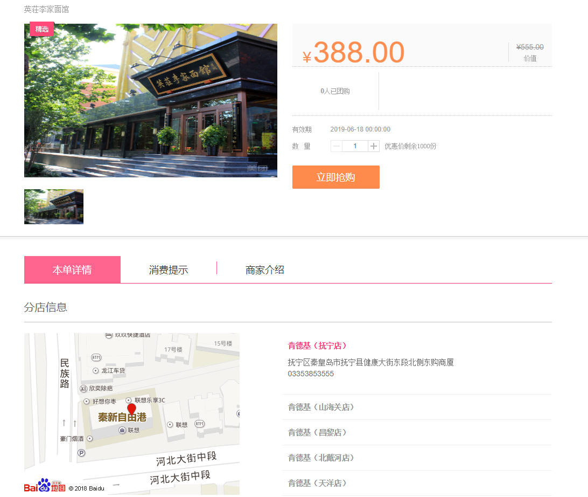
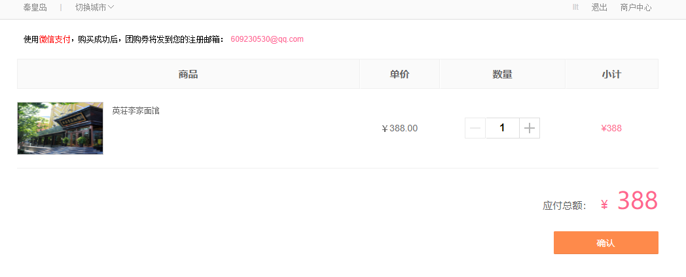
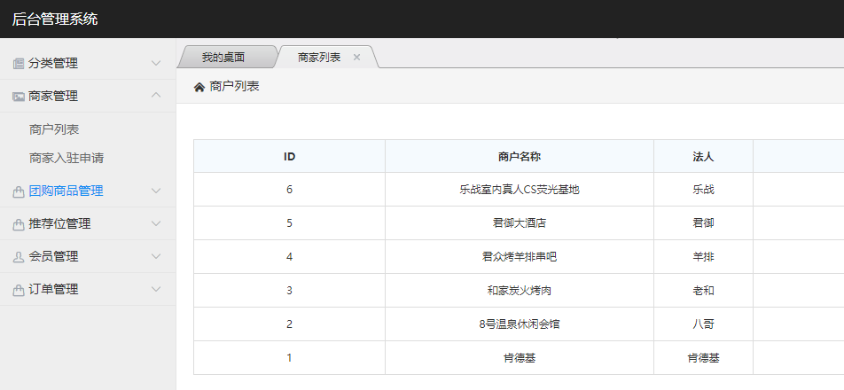

## 仿百度糯米团购网站

## 实现的功能：
#### 前台
1. 用户的注册，登录
2. 从数据库获取分类，城市，商品，轮播图数据
3. 商品详情页
4. 订单确认页
5. 支付（todo）
6. 个人中心（todo）

#### 商家后台
1. 店铺管理
2. 团购商品管理

#### 平台后台
1. 商家管理
2. 用户管理
3. 分类管理
4. 广告管理
5. 团购商品管理

## 网站部分截图

## 网站部署地址

47.93.60.125   (暂未绑定域名)
